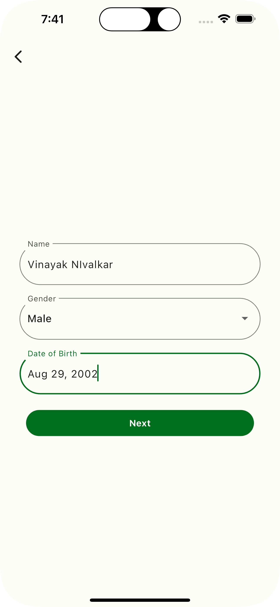
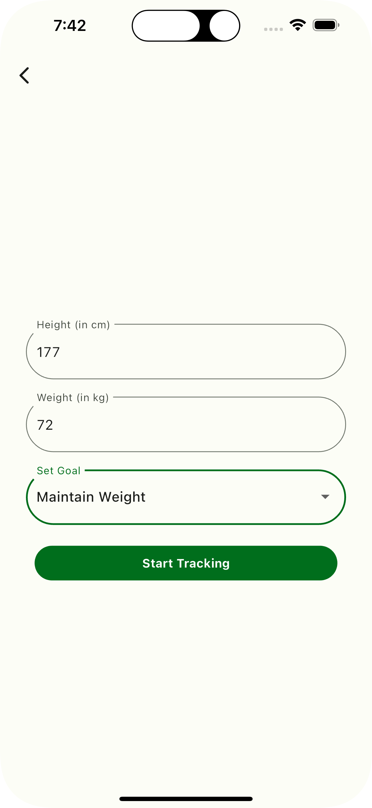
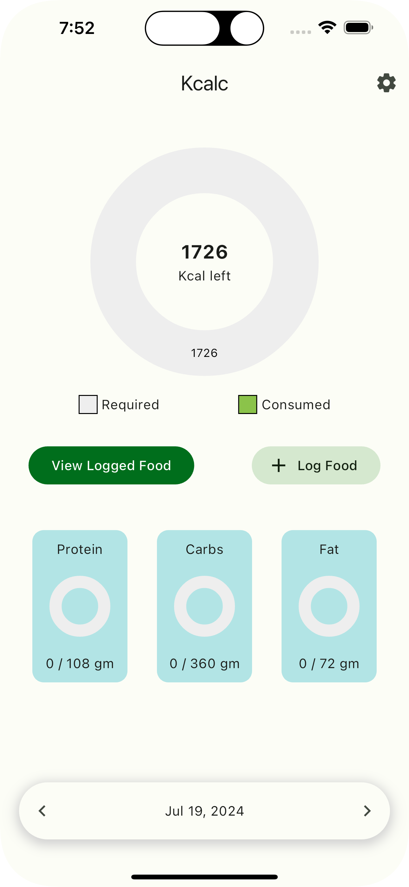
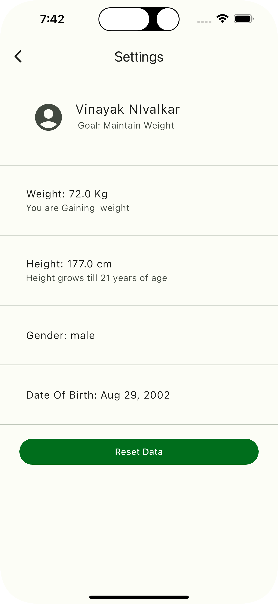
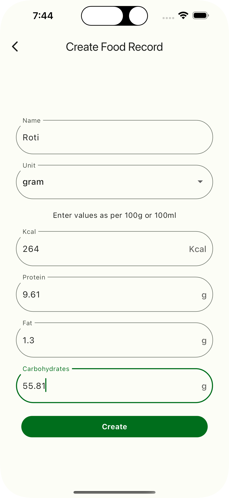
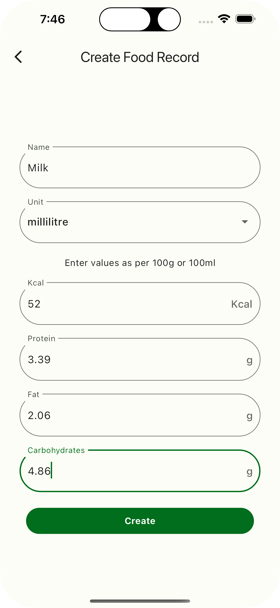
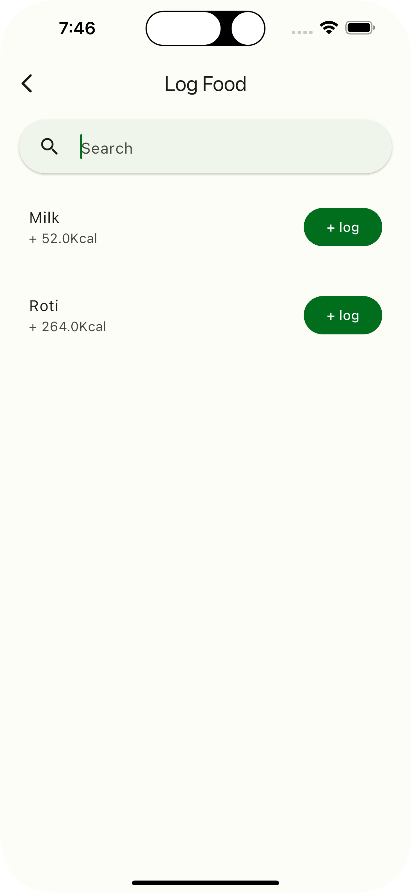
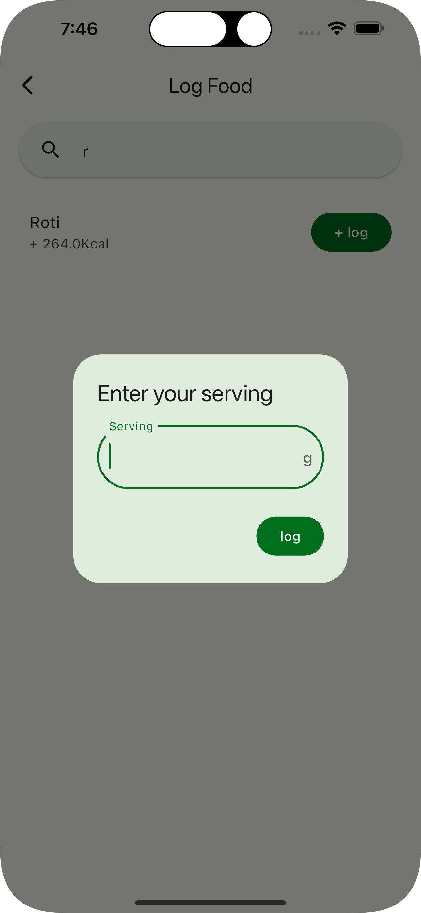
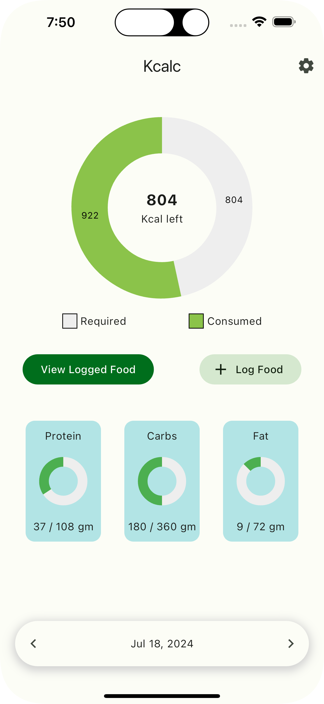
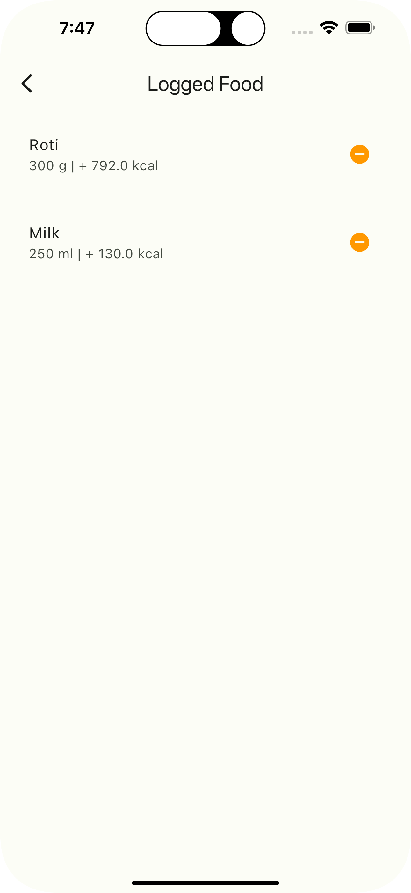

# Kcalc
## Calorie Tracker Application

> Created as an MCA Sem I Project by Vinayak Nivalkar

A Calorie Tracking App that lets users track
their diet and receive calorie Recommendation,
accordingly it uses algotithms like [Mifflin St Jeor](https://reference.medscape.com/calculator/846/mifflin-st-jeor-equation) to calculate Basal Metabollic Rate and other
algorithms to calculate fat, protein and carbs
consumption.

---
## Technologies Used
| Technology | Used For |
| -------- | ------ |
| Flutter | App Frontend |
| Dart | App Frontend |
| Isar | Local Database |
| Riverpod | State Management |

---
 

  
  
  
  
  
  
  
  
  
  
  

